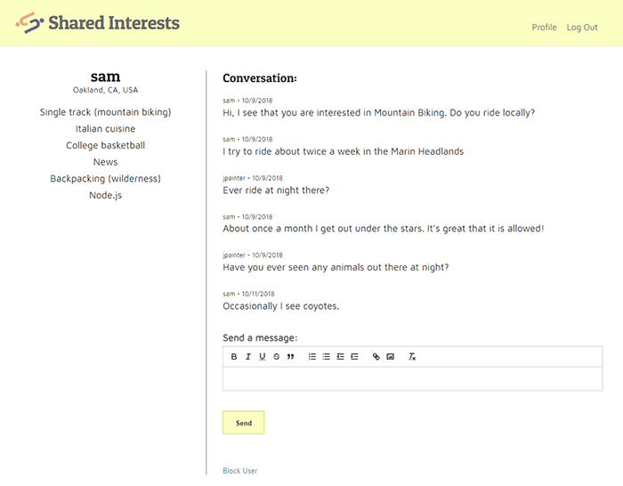

# Shared Interests

## Live App:

[http://www.oursharedinterests.org](http://www.oursharedinterests.org)

## Summary:

Shared Interests is a social network where users can generate a list of interests and have message based conversations with other users based on their interests and or location. When creating an account, a user provides a screen name which allows for anonymity and enters a location chosen from Google Maps information. A list of interests is created created using autocomplete suggestions that are taken from Wikipedia. In the user’s profile area, the user can see a list of other users that have matching interests, geographically nearby users, and other interest categories and users. When one of these users is chosen, the user can see their location and list of interests and start a  text based conversation. A user can block another user at any time.

## Motivation:

Studies have shown that the most important factor in friendships is shared interests. I created this app in order to provide a way for people to create comprehensive lists of specific interests and to connect with others based on their interests. Someone could use this app to connect with another person with a single obscure shared interest. It could be used to find a local person with an interest in a specific activity. Other uses would be to connect with others over overall sets of interests or to speak about a favorite interest others. This app is different than other social media platforms in that it allows a user to state their interests explicitly and in detail, can be anonymous, and could be used for friendship, information, or romantic connections.

## Technologies Used:

This app is single-page and uses React with Redux on the front-end. It is responsive and optimized for mobile as well as desktop display.  React autocomplete components are used to connect with Wikipedia for interests and Google Maps for locations. The React-Quill rich text editor is used for message creation. React Router is used to display different screens based on urls and Redux Form is used for the Login and Registration forms. Front end tests are created with Jest and enzyme. The front end uses Travis CI for integration testing and builds and uses Heroku for deployment. The front end communicates to the back end through a REST api. 

The back end can be found in a separate repository:
[https://github.com/jmpainter/shared-interests-api](https://github.com/jmpainter/shared-interests-api)
 
The Shared Interests API was created with Node.js and the Express.js framework. Morgan is used for logging, joi for request validation, and haversine for distance calculations based on latitude and longitude. Passport.js is used for local and json web token authentication. The database used is Mongodb and mongoose is used as an object data manager. The Github source repository is integrated with TravisCI for integration testing and builds. TravisCI is integrated with Heroku for deployment. The MongoDB database is hosted at mLab. The app contains integration tests created with the Mocha test framework and the Chai assertion library.

## Screenshots:

Start Screen:

Register:

Add / Edit Interests:

Profile Screen

Conversation

## API Documentation

POST /auth/login - for user authentication

POST /auth/refresh - for JSON Web Token renewal

POST /users - for user account creation

GET /users - for retrieval of an authenticated user’s non-sensitive account information

GET /users?interests=true - for retrieval of other users by matching interests

GET /users?nearby=true - for retrieval of other users by nearby location

GET /users?other=true - for retrieval of other users with non-matching interests

GET /users/:id - for retrieval of another user’s username and interests

PUT /users/:id - for updating user information

GET /interests - public retrieval of latest interests in the system

POST /interest - add and interest to list of user’s interests

DELETE /interest/:id - delete a user’s interest

GET /conversations - get conversations for an authenticated user

POST /conversations - create a conversation between users

POST /conversations/:id/messages - create a message for a converation

## Author:

[Josh Painter](http://joshuapainter.com/)

